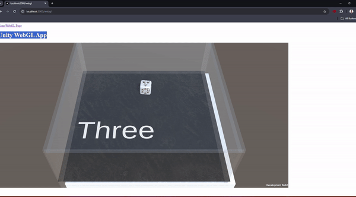

**Key Highlights** :

- Leveraged Unity's WebGL2 build feature to make the app browser-ready.
- Integrated it smoothly into a **React component** within a Next.js 14 application.
- Served all the Unity assets through Next.js, making the entire experience seamless and fast.

```
yarn install
yarn dev
```


